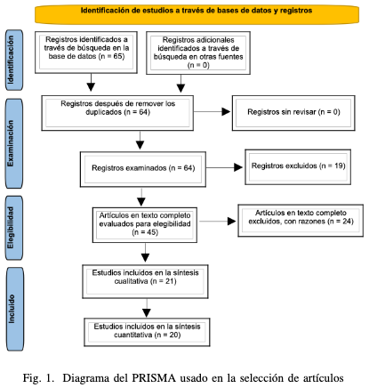
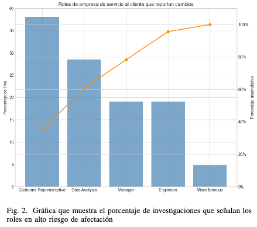
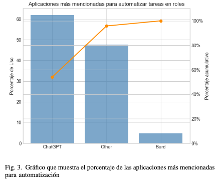
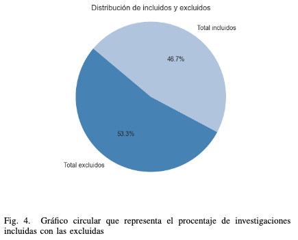

# Explorando el impacto laboral de las tecnologías de generación de texto pre-entrenado (GPTs): una revisión de literatura

## Abstract
En una sociedad cada vez mas influenciada por el avance tecnológico, las GPTs están estableciendo nuevos estándares en la automatización con un impacto significativo y aun incalculable en el futuro del trabajo. Esta revisión de literatura se analizan las metodologías utilizadas en las investigaciones que se enfocan en el impacto de las GPTs en el mercado laboral. Se identificaron que las ocupaciones de mayor afectación dentro de una empresa de servicio al cliente eran las de agente de servicio al cliente y análisis de datos. Además se confirmó que la aplicación de GPT más utilizada para la automatización de tareas es ChatGPT de OpenAI.

## Metodología
Se utilizó el método de PRISMA para ir conociendo y filtrando las investigaciones que eran importantes en esta
revisión de literatura.

## Resultados
De las investigaciones revisados por multiples bases de datos, se obtuvo cuales son las ocupaciones más afectadas.
Esto se puede visualizar en la siguiente gráfica:

De las aplicaciones más mencionadas para la automatización de tareas se encontró que era ChatGPT. Esto se puede observar mejor a continuación:

## Limitaciones
Fueron muchas las investigaciones que no se usaron por su poca relevancia con el tema de investigación. 

## Link paper completo

[Link here](./rev_lit.pdf)
